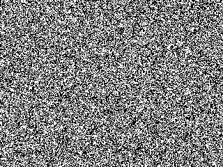
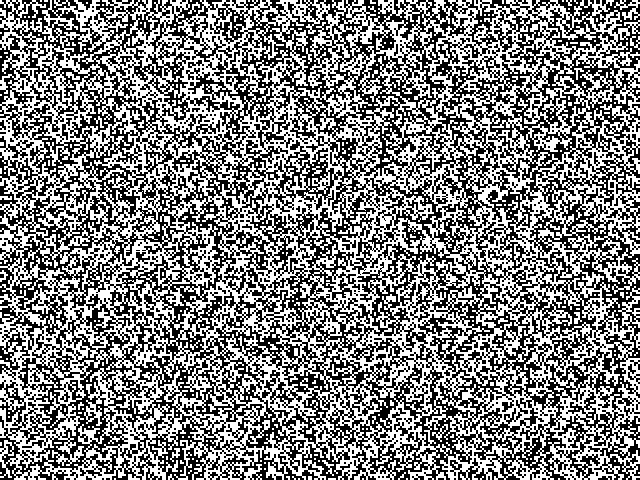

# ghostbuster

Recovers "human-only" text that is hidden in the motion of a noise video.

<table>
<tr>
<td align="center"><b>Input clip</b> (play it)</td>
<td align="center"><b>Decoded</b></td>
</tr>
<tr>
<td></td>
<td></td>
</tr>
</table>

Pause the clip on any single frame and it is just static:



## The trick

The text is not hidden in brightness, it is hidden in motion. A field of
black-and-white noise scrolls behind the frame. Inside the letters it scrolls
**up**, everywhere else it scrolls **down**. Every individual frame is the same
uniform noise, so a screenshot shows nothing. Only when the video plays does the
opposing motion draw the letters out.

So this is not an AI-proof font. It is a screenshot-proof one. Anything that
sees more than a single frame, including this decoder, reads it straight through.

## How the decoder works

For each pair of consecutive frames it correlates them shifted up and down by a
few pixels. Upward motion counts positive, downward negative. One frame pair is
almost pure chance, but summing over the whole clip and pooling over small blocks
makes the sign reliable: positive blocks are the text, negative blocks are the
background. Threshold the sign and you have the mask.

That is the whole method, about 30 lines in [`ghostbuster/decoder.py`](ghostbuster/decoder.py).

## Usage

```bash
pip install -r requirements.txt
```

```python
from ghostbuster.decoder import decode_ghost_video

mask = decode_ghost_video("clip.mp4", velocity=2, num_frames=60)
# mask: binary image (0/255), white where text was detected
```

Web app (upload a clip in the browser):

```bash
python app.py          # http://127.0.0.1:8000
```

Regenerate the demo assets and a sample `assets/demo.mp4` to try:

```bash
python scripts/make_demo.py
```

Run the tests:

```bash
pytest
```

## Parameters

- `velocity` - pixels per frame the text and background move in opposite
  directions, usually 1 to 3. If a clip does not resolve, sweep this.
- `num_frames` - frames to read. More frames give a cleaner result. 30 to 120 is
  a good range.
- `block_size` - spatial pooling window, default 12.

## Limits

- Heavy video compression smears the noise and hurts recovery. Test on the
  original clip, not a re-encoded download.
- If `velocity` is large relative to the noise grain you can hit temporal
  aliasing and the sign flips. Downscale or read fewer frames if that happens.
